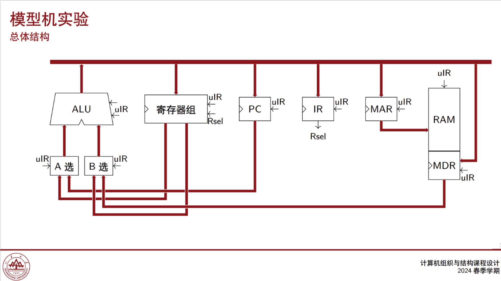
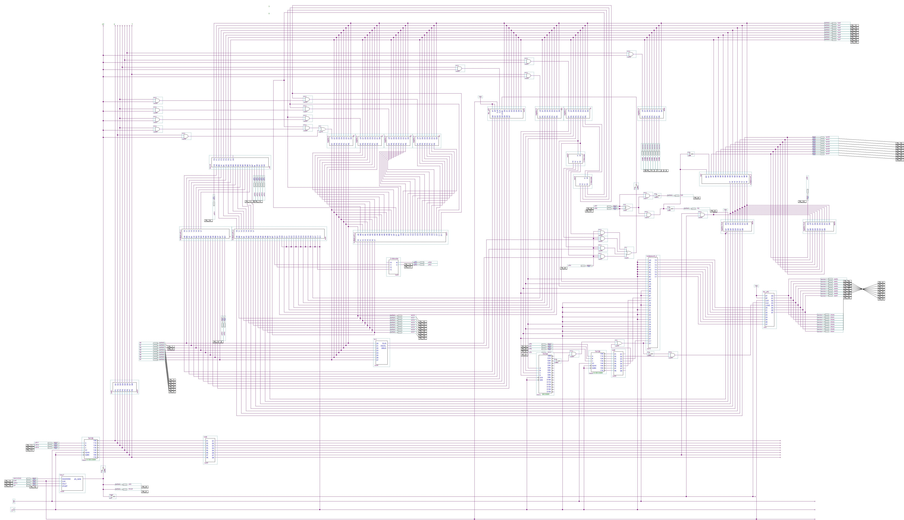

# 目录

- [课程要求](#课程要求)
- [项目结构](#项目结构)
- [遇到的问题](#遇到的问题)
- [注意点](#注意点)
- [参考资料](#参考资料)

# 课程要求

每年的课程要求都会改变，今年（2024）的要求是部件实验的后两次（共四次）计入分数，前两次只需要去实验室签到，整机实验（四周）也计入分数，整机实验的要求在 PPT 第七讲里，拓展要求一为实现多种寻址方式，以及跳转指令，拓展要求二有两个，我们实现了链表求和。





# 项目结构

```shell
D:.
├─PPT
├─整机实验
│  └─Pc
│      ├─db
│      └─incremental_db
│          └─compiled_partitions
├─测试指令
└─部件实验
    ├─ALU
    │  ├─ALU-16
    │  │  └─db
    │  └─ALU-8
    │      ├─db
    │      └─incremental_db
    │          └─compiled_partitions
    ├─not8
    │  ├─db
    │  └─incremental_db
    │      └─compiled_partitions
    ├─多路选择器
    │  ├─multiplexer4_3
    │  │  ├─db
    │  │  └─incremental_db
    │  │      └─compiled_partitions
    │  └─multiplexer8_4
    │      ├─db
    │      └─incremental_db
    │          └─compiled_partitions
    ├─寄存器
    │  ├─register-4
    │  │  ├─db
    │  │  └─incremental_db
    │  │      └─compiled_partitions
    │  └─register-8
    │      ├─db
    │      └─incremental_db
    │          └─compiled_partitions
    ├─微程序控制的访存系统
    ├─微程序控制的运算器
    │  └─uIR-Counter
    │      ├─db
    │      └─incremental_db
    │          └─compiled_partitions
    ├─移位器
    │  ├─Shift-4
    │  │  ├─db
    │  │  └─incremental_db
    │  │      └─compiled_partitions
    │  ├─Shift-8
    │  │  ├─db
    │  │  └─incremental_db
    │  │      └─compiled_partitions
    │  └─SHR_8ASR
    │      ├─db
    │      └─incremental_db
    │          └─compiled_partitions
    ├─计数器
    │  ├─Asynchronous-mode-256-Plus-1-counter
    │  │  ├─db
    │  │  └─incremental_db
    │  │      └─compiled_partitions
    │  └─Asynchronous-mode-8-Plus-1-counter
    │      ├─db
    │      └─incremental_db
    │          └─compiled_partitions
    └─译码器
        ├─2-4decoder
        │  ├─db
        │  └─incremental_db
        │      └─compiled_partitions
        └─3-8decoder
            ├─db
            └─incremental_db
                └─compiled_partitions
```

- **PPT**：czy 老师的课堂讲课 PPT，一些实验要求会在上面，有时候做不出来看看 PPT 也挺好，说不定哪句话、哪些内容就启发你了。
- **部件实验**：前两周就是做一些基础的部件，然后进行测试（很重要），部件最后两周开始上难度，需要做两个分别为微程序控制的访存系统、微程序控制的运算器。这相当于后面整机实验的开胃小菜。这些文件都在部件实验文件夹里，但由于一开始我们的整机实验是从我们的微程序控制的访存系统的基础上改造的，导致微程序控制的访存系统这个实验没了，所以没上传。
- **整机实验**：完整的整机实验，可参考电路图的布局，相关的时序设计，其他的看看就行。
- **测试指令**：ROM 文件是微指令，RAM 文件是指令，用来测试微指令是否正确，展示时，部分有关数据的指令要根据老师说的进行填写，然后运行。

# 遇到的问题

下面列举我们整机实验时遇到的问题：

- **管脚接错**：RAM 的地址管脚和数据管脚接反了。
- **指令输错**：在向 ROM 和 RAM 写指令时，因为要写很多，所以容易写错。
- **ACC 里的数据莫名奇妙的消失**：时序问题，总是在牵扯到 PC 和 MAR 的微指令时，ACC 数据消失，最终用了学长的时序设计 ---- 脉冲上的非门的添加，从而解决。
- **uPC 跳转异常**：模 256 加 1 计数器有问题，但我们单独测试过部件，它是完好的，最终也是换到了学长的 uPC 的部件就解决了。
- **PC 跳转异常**：指令设计和硬件不协同的问题，之后在注意点中会说。

上面的问题可能不全，但大概就是这些，只要电路图没画错，指令是正确的就可以。上面困扰我们最久的问题就是**ACC 里的数据莫名奇妙的消失**和**uPC 跳转异常**，在解决这个问题之前，我们都面临着挂科的风险，而一旦解决，之后就会势如破竹，一马平川，所以非常非常感谢学长的无私开源！！！

# 注意点

1. 关于**电路仿真**的问题：czy 老师班的学生，在我们这一届用的是老版本软件，无法进行电路仿真，其他老师的班用着新版本软件，可以线上进行电路仿真（不用被实验室的实验箱所束缚），ROM 和 RAM 可以在自己的电脑上进行编写测试，这可以规避很多问题，节省大量时间，但配置新软件很麻烦，所以如果想要电路仿真，请尽早进行配置使用。我们知道可以进行电路仿真时，为时已晚，只能一条路走到黑……
2. 关于**时间分配**的问题：部件实验就不说了，一次一周，但整机实验虽然有四周，但最后一周要用来验收，所以实际上只有三周时间，最耗时间的不是最初的画图和编指令，而是上机调试，所以尽量早上机。我们就是第三次才上机，发现问题很多，然后忙的不可开交。
3. 关于器件（**带预置位的计数器**）的问题：这个器件，在同时有脉冲和预置信号时，优先预置，次先计数+1，但预置也需要脉冲，所以如果你条件满足，成功跳转，这是没问题的，**问题就在于条件不满足，不用跳转时，这时你需要向下继续执行指令，但和预置信号一起的脉冲会多让 PC 加一次 1**，所以在设计指令时 PC+1 可以少一次，从而避免上述问题，可参考指令里的 JMP 指令。
4. 关于**实验器材**：实验箱的系统占用那一排灯，能不绑定就不绑定，可能会出问题，我们绑了一次，导致 ACC 没有任何输出，不知是不是这个的问题；还有有些实验箱的连续脉冲不能用，我们验收那一天用的第一个实验箱连续脉冲就是坏的。
5. 关于**验收**的问题：部件实验一般不会问问题，但整机实验时，老师会分别根据指令设计和电路设计问一些问题，然后再随即问一个本质的问题，对两个同学分别进行等级评定。**一条指令是由多条微指令解释的。**

# 参考资料

[一位学长的 B 站主页](https://space.bilibili.com/506973721/?spm_id_from=333.999.0.0)里面有全套的讲解视频，从单个部件到整机，从做什么到如何做，非常详细。

[他的 Github 项目](https://github.com/Liyanhao1209/Computer-Organization-Overall-Design)，我们的时序问题以及带预置位的计数器就是从这里借鉴~~(抄)~~来的。

_可以借鉴参考整个项目的各部分设计，但请不要直接抄袭，并用于学校的作业或课程设计！作者保留了开源的所有记录以及声明，由于抄袭产生的后果作者概不负责！_
